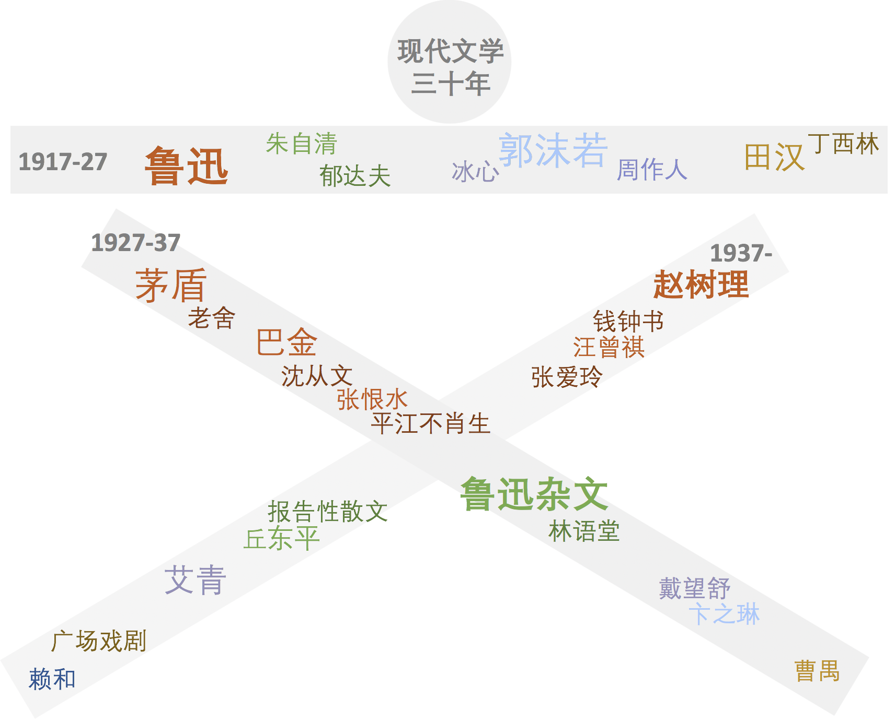
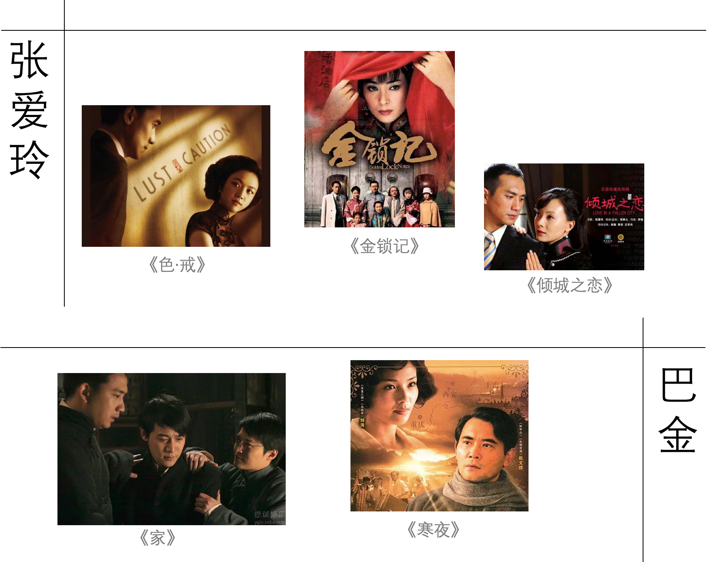

#【笔记】中国现代文学1917-1949

这是中国现代文学的纲要介绍，大部分内容基于钱理群《现代文学三十年》。

## 复习两步走

**第一步：把“百度百科”式知识搬进脑子**

纵观全书，我们可以看到本书的内容十分翔实繁复，然而对于文科考试而言，“会背”是必不可少的一门功夫。在考场上没有书，没有网络，如何做到答题快准狠？必要的第一步就是首先把百度百科式的知识种进脑子，不必思考就可以引出史实、人物。

经过自己的尝试和探索后，发现以下方式三重保险核实知识的到位十分有用：

- 串时间，即记住每个十年有哪些大事件
- 串人，即记住每个人的作品史，比如鲁迅《呐喊》《彷徨》是在第一个十年，而第二个十年他大多转战散文
- 串大事件中的人物轨迹，即记住比如淞沪战争，可以引出在此期间张爱玲、萧红等各个作家的不同经历和作品

**第二步：学做文学评论家**

可以查查和中国现代文学最相关的论文大多讲哪些主题？查查你们科系的老师的论文大多从哪个方向写？收集一些题目，可以讲出来自己的意见，也可以写在纸上。

### 第一步：记忆练习

下面是我自己复习时制作的游戏式知识串联。

**第一个游戏：认名字**

> 你认识下图中的每一个名字吗？

如果是，那太棒了！如果不是，可以像读故事一样，读读看他们的（1）百度百科和（2）作品节选（一部你感兴趣的即可），想象你在一个火车里，每个车厢都坐着一个时代的文学家们，希望你与他们的结识又好玩又新奇😄

**第二个游戏：收集电影电视**

> 你记得以前看过的电影电视吗？诸如《色·戒》《金粉世家》其实都是这些作者们的大作呢！

正如看过三国的影视剧的人难忘哪些文官武将的名字一样，要记住中国的小说，不妨让影视剧来帮你一把。看过再难忘～

### 第二步：学做文学评论家

一定要多看看历届考题都是怎么考的，用考题来把这些知识正规化、扎实化。

当然也可以上图书馆、知网看看别人写的文学评论，把文学工夫做扎实，也为未来的写论文做准备。

